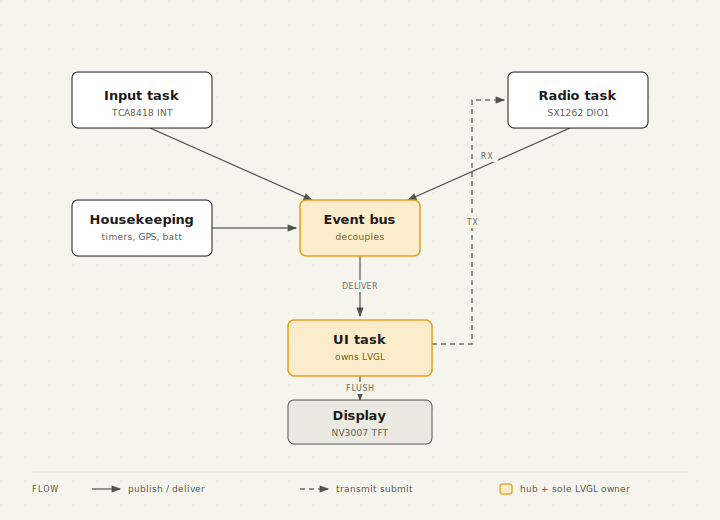

The code is organised as ESP-IDF components, layered from the bottom up. The lower layers
hold no ESP-IDF, LVGL, or FreeRTOS includes, so the protocol, crypto, and layout logic
compiles on a PC and runs under the host test suite.

## Components

```
main/                   app_main.c boot sequence, board_pins.h, app_config.h (bsp)
components/
  core/    portable   event bus, schema settings (plus NVS store), node DB
  mesh/    portable   AES, Meshtastic crypto, packet, regions, nanopb protobufs
  util/    portable   NMEA parser
  net/     portable   message types, dedup, router, Meshtastic backend
  drivers/ esp-idf    NV3007 display, TCA8418 keyboard, SX1262 radio, GPS, battery, power
  radio/   esp-idf    radio task: receive ISR to parse, transmit queue, listen-before-talk
  services/esp-idf    status sidebar, mesh beacon, time from GPS, battery, gps
  ui/      lvgl       theme, frame, sidebar, bottom bar, launcher strip, icons
  apps/    lvgl       launcher plus Messages, Nodes, Diagnostics, Settings, GPS
```

The `core`, `mesh`, `util`, and portable parts of `net` and `ui` register their CMake
components with no IDF dependency. The same source files compile into the firmware and into
`host_tests/`.

## Tasks

Four FreeRTOS tasks own the runtime work.

| Task | Owns | Wakes on |
|------|------|----------|
| `ui` | LVGL, the apps, the launcher, input dispatch | the next LVGL timer |
| `radio` | the SX1262 receive, transmit, and CAD state machine | the DIO1 interrupt |
| `kbd` | TCA8418 decode, function key and modifier state | the keyboard interrupt |
| housekeeping | beacons, clock, backlight policy | timers |

## Event bus and threading



A small synchronous event bus carries events such as `EV_MESSAGE_RECEIVED` and
`EV_MESH_NODE_UPDATE`. Handlers run on the publisher's stack, so they stay short and never
call LVGL.

LVGL is single threaded. Only the `ui` task touches it. The radio task publishes received
messages into a queue, and the apps drain that queue on their own timer inside the UI task.
This keeps every LVGL call on one thread.

## Boot sequence

`app_main()` brings things up in order: NVS and the node identity, the settings registry,
the display, theme, and chrome, the keyboard, the network config and radio, the background
services, the apps, and finally the power policy. The UI task starts last, so all the LVGL
objects are built on one thread before that task begins running.
